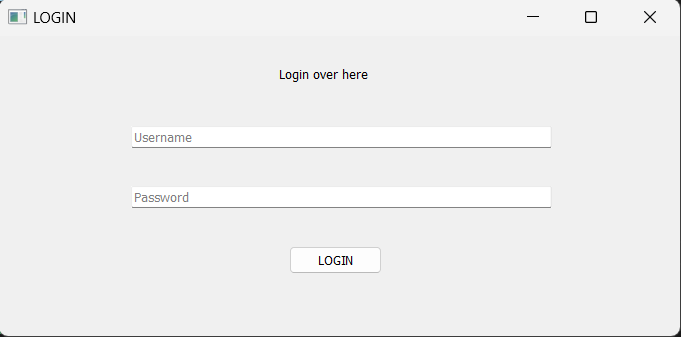
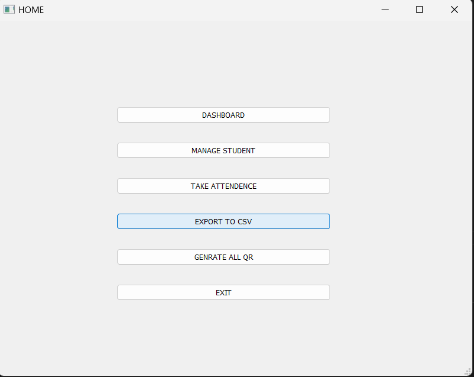
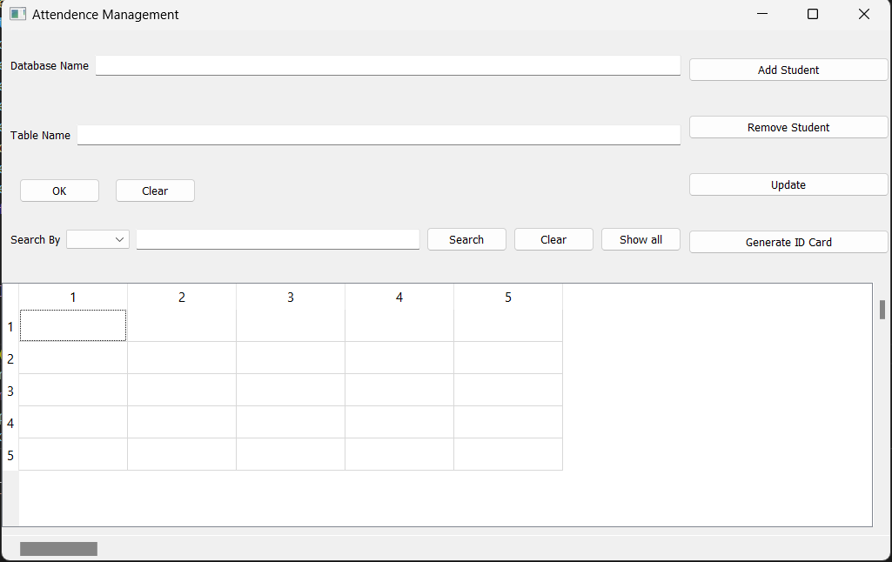
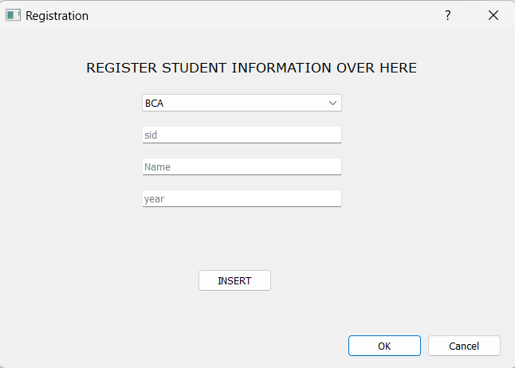
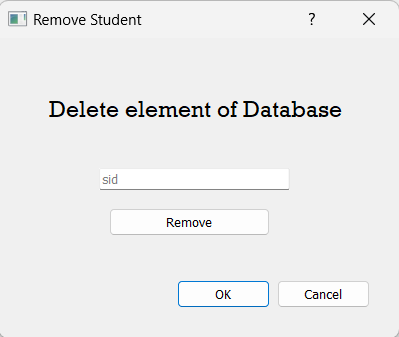
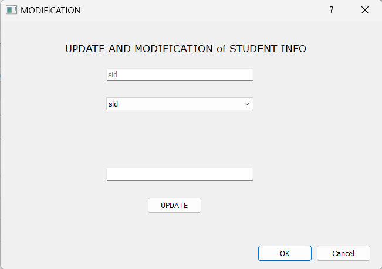
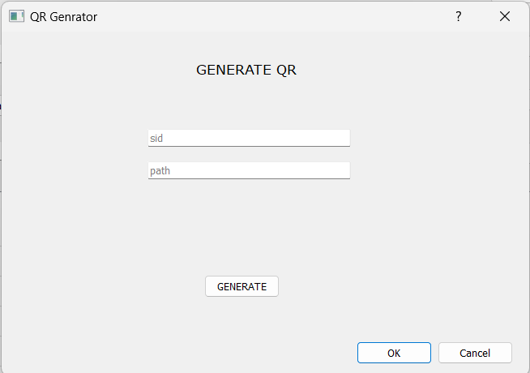
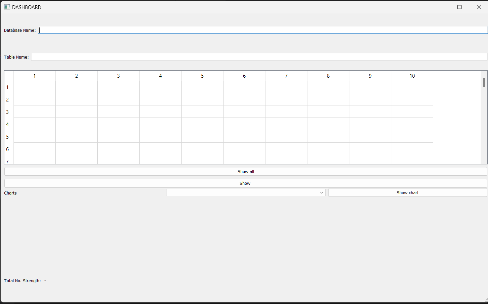
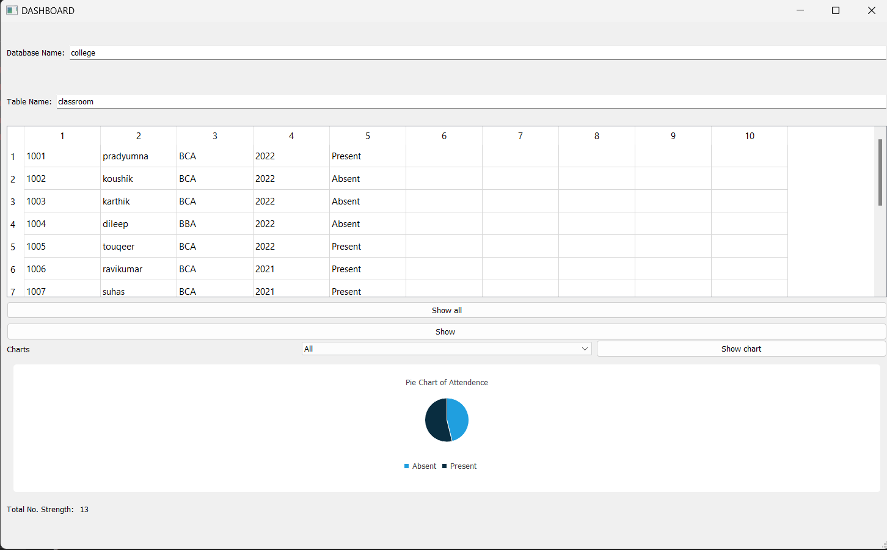
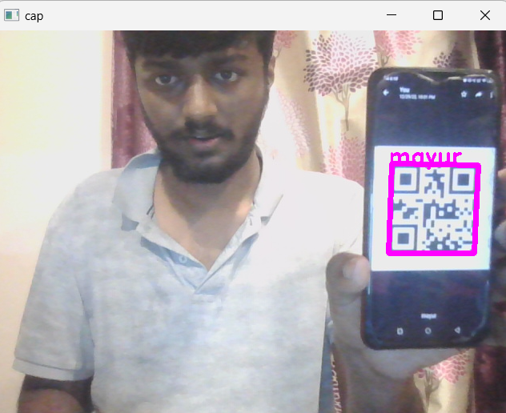

# Smart Attendance System

About The Project:

This is a GUI application which is built using PyQT5 Module in Python. It is capable to perform following task -

* It takes Attendance of the Students by Qrcode Scanning method and it Genrates Qrcode of every Students.
* It automatically stores the attendance values into MySQL DataBase
* Every student is provided with an ID-card that contains the QR-code. Students just have to scan their cards using a QR-Code scanner and the system notes down their attendance
* This Application is capable of detecting the liveness of Qrcode i.e., it can detect if the attendance is being marked in real time by the given Student's their own ID card only and not spaming by using other ID card with Qrcode while Scanning time the video will be recorded the admin can check when ever recording the attendance it is mandotary to check the video record.

## Deployment

To Run the program

```bash
  Python loginpage.py
```
To create the Database
```MySQL
  create database college;
```
To create the table
```MySQL
  create table classroom(sid int,name varchar(20),Department char(5),year int,attendence char(10));
```
Set the MySQL User Account 
```MySQL
  mysql> CREATE USER ‘root’@’localhost’ IDENTIFIED BY ‘root’;
```
Install the QT Desiger Software to drag and drop the GUI widgets and design application


Link : https://doc.qt.io/qt-6/qtdesigner-manual.html
## Installation

Install my-project with git

```bash
  apt-get install git+git clone https://github.com/pr4dyumn4/SmartAttendenceSystem
  cd SmartAttendenceSystem
```
To install the requirements

```
    pip install -r requirements.txt
```
## Screenshots
LOGIN PAGE:
This is the Admin Login page for authentication. Username and password

HOME PAGE:
This is the main page of application,Manage Student,Dashboard,Export to CSV,Generate all Qrcode,It can also scan the qrcode while scanning the video will be stored in the video File Admin can check so that no fake attendence is marked.

MANAGEMENT PAGE:
IN here student data can be added, updated, deleted, Generate single Qrcode.





Dashboard PAGE:
Here you can view the attendence and strength of classroom through pie chart you can view attendence
 
 
SCANNING WINDOW:


## 🚀 About Project
This is a GUI application made to manage the Attendance of students using QR Scan.
## Used By

This project is used by the following Organization:

- School
- College
- University
- Other Educational Institution
